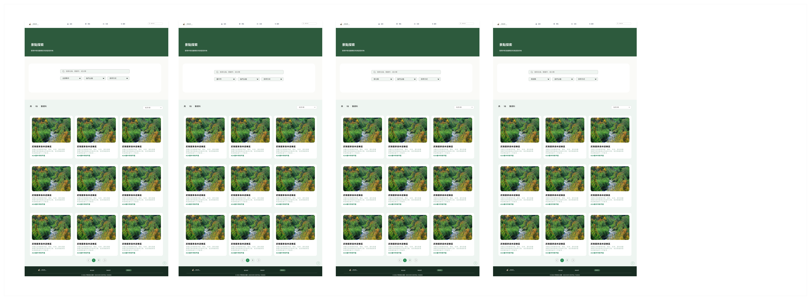
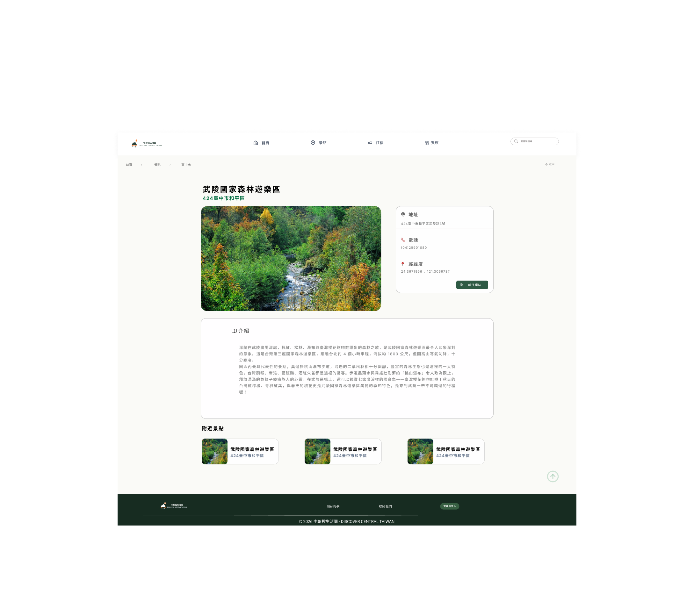
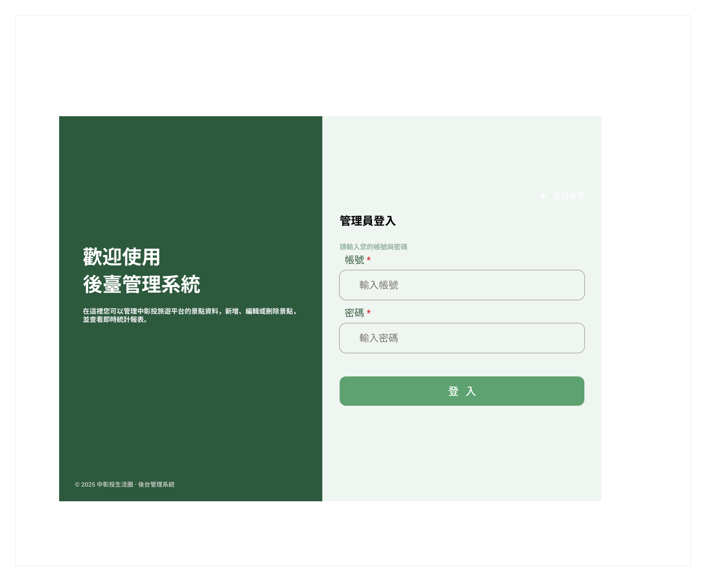
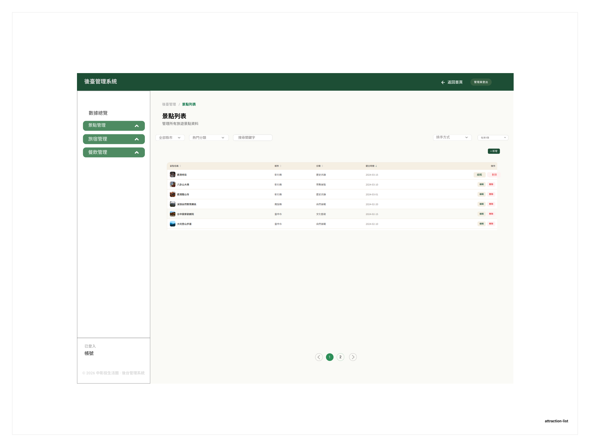
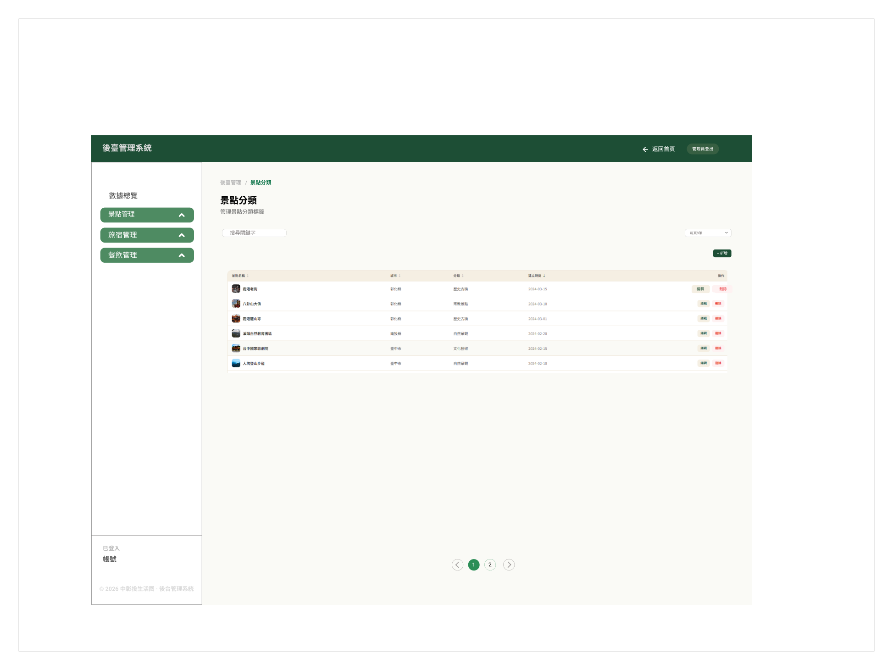

# 中彰投生活圈

> 陪你隨心所欲，輕鬆玩遍中彰投

[GitHub 專案](https://github.com/012wu/DISCOVER-CENTRAL-TAIWAN)


## 專案介紹

「假日該去哪裡晃晃？」是我們最常問自己的一句話。**中彰投生活圈**是一個以台中、彰化、南投為主的旅遊資訊平台，將中臺灣的景點、旅宿與餐飲資訊集中整理，提供簡單清晰的旅遊資訊查詢方式。

平台提供縣市與分類篩選、關鍵字搜尋、排序、分頁以及詳細資訊查看等功能，並整合中央氣象署 API，提供台中、彰化及南投的天氣資訊。另外規劃一日遊與 AI 推薦行程功能，希望讓使用者不需要花費大量時間查詢資料，就能快速規劃中彰投地區的旅遊行程。

## 使用技術

| 類別        | 內容                                                                                           |
| ----------- | ---------------------------------------------------------------------------------------------- |
| Frontend    | HTML、CSS、JavaScript、Vue.js（CDN）、jQuery、Bootstrap 5、Font Awesome、SweetAlert2、Chart.js |
| Backend     | PHP、Laravel                                                                                   |
| Database    | MySQL                                                                                          |
| API         | 中央氣象署 OpenData API、觀光局 OpenData                                                       |
| 設計與視覺  | Figma、Figma Make、Canva                                                                       |
| 開發工具    | Visual Studio Code、Git、GitHub、XAMPP、phpMyAdmin                                             |
| AI 輔助工具 | Claude、ChatGPT、Gemini                                                                        |

### AI 使用方式

1. 使用 **Figma Make** 產出網頁範例，作為前台頁面設計與版面配置的初始參考。
2. 使用 **Canva + Gemini** 協助產出首頁封面、Banner 等視覺素材，以及網站文案初稿，再依照網站定位進行修改與整理。
3. 將建立好的 Figma 畫面提供給 **Claude**，協助產出前台與後台共用的 CSS 樣式，再使用 **ChatGPT** 協助進行調整與優化。
   











4. 其他開發過程中視情況搭配使用 **Gemini／ChatGPT／Claude**，協助程式除錯、邏輯討論與文件撰寫。

## 系統功能

### 前台網站

**登入頁**：三張照片輪播，點擊進入首頁。


**首頁導覽列**：Logo、首頁、景點、旅宿、餐飲。

**Banner**：三張圖片輪播，可點擊切換圖片。

**探索中彰投區域**：提供臺中市、彰化縣、南投縣三個縣市的介紹卡片，點擊後可進入景點相關頁面。

**活動資訊**：串接觀光局 OpenData，取得近期活動資料，目前設定為抓取現在至 5 天後的活動，最多顯示 9 筆。

**天氣資訊**：串接中央氣象署 API，取得臺中市、彰化縣、南投縣天氣資訊。

**其他功能**：各縣市政府 Logo（可連結至各縣市政府網站）、關於我們、聯絡我們彈跳視窗、回到頁首按鈕、管理員登入／登出、後台管理系統入口。


### 景點／旅宿／餐飲列表

三類資料皆提供一致的篩選與瀏覽功能：

| 功能類型 | 內容                                               |
| -------- | -------------------------------------------------- |
| 篩選功能 | 全部縣市、熱門分類、關鍵字搜尋、排序方式、筆數篩選 |
| 列表功能 | 資料統計、每頁顯示 15 筆、卡片呈現、分頁功能       |


點擊卡片後以彈跳視窗顯示詳細資訊，各類型顯示欄位如下：

| 類型 | 詳細資訊欄位                                                               |
| ---- | -------------------------------------------------------------------------- |
| 景點 | 名稱、縣市地區、圖片、地址、電話、經緯度、景點連結、景點介紹、附近景點推薦 |
| 旅宿 | 名稱、縣市地區、圖片、地址、電話、經緯度、價格、旅宿介紹、附近旅宿推薦     |
| 餐飲 | 名稱、縣市地區、圖片、地址、電話、經緯度、餐飲介紹、附近餐飲推薦           |


### 後台管理系統

**管理員登入**：提供管理員登入、登出，並以 Session 管理登入狀態。


**數據總覽**：後台預設首頁，統計景點、旅宿、餐飲總數，並以圓餅圖呈現三種類型資料的數量比例；另提供回到前台首頁、管理員登出。

>)

**景點／旅宿／餐飲管理**：提供完整的資料管理功能，包含全部縣市、熱門分類、關鍵字搜尋、排序方式及每頁筆數等查詢與篩選條件，並提供資料統計與每頁 15 筆的分頁列表。分類名稱可自動同步帶入「分類管理」中的資料，並支援新增、查詢、修改、刪除等完整 CRUD 功能。


**分類管理**：提供景點、旅宿及餐飲分類的關鍵字搜尋、排序、篩選、分頁，以及新增、修改、刪除分類，分類資料由 MySQL 資料庫管理。


## 熱門分類資料處理

本專案的「熱門分類」並非直接使用 OpenData 原始分類名稱，而是根據資料中的 `ClassNo`，對應政府觀光資料標準所定義的分類，再依網站使用需求整理成較容易理解及使用的熱門分類。分類資料主要參考「觀光資訊標準格式 V1.0」與「觀光資料標準 V2.1」，透過 `ClassNo` 與標準分類名稱進行對應，建立前台及後台使用的分類資料。

**景點熱門分類**

| 分類              | 項目                                                                                                               |
| ----------------- | ------------------------------------------------------------------------------------------------------------------ |
| 1. 自然與生態景觀 | 生態類、國家公園類、國家公園類景點、國家風景區類、自然保育類、森林遊樂區類、平地森林園區類、水域環境類、生態場域類 |
| 2. 人文歷史與藝文 | 文化類、文化資產類、藝文場館類、藝術類、宗教類、原住民族文化類、客家文化類                                         |
| 3. 休閒與公共設施 | 休閒農業類、風景類、遊憩類、都會公園類、公園綠地類、體育健身類、娛樂場館類                                         |
| 4. 產業與交通觀光 | 觀光工廠類、觀光產業類、商圈商店類、交通場站類、其他                                                               |

**餐飲熱門分類**

| 分類              | 項目                                                                                         |
| ----------------- | -------------------------------------------------------------------------------------------- |
| 1. 在地與台式風味 | 台灣小吃／台菜、夜市小吃、火鍋、海鮮、便當／自助餐、牛肉麵、粥品、地方特產、伴手禮／禮盒     |
| 2. 日韓與亞洲料理 | 中式料理、港式料理、日式料理、韓式料理、南亞料理、東南亞料理                                 |
| 3. 其他異國與聚餐 | 美式／歐式料理、其他異國料理、燒烤／鐵板燒、牛排、速食、連鎖餐飲、吃到飽                     |
| 4. 甜點輕食特殊餐 | 甜點冰品、麵包糕點、非酒精飲品、酒類飲品、純素飲食、素食飲食、清真飲食、無麩質飲食、健康飲食 |

**ClassNo 對應流程**

```text
OpenData → 取得 ClassNo → 對應觀光資料標準 → 取得標準分類名稱
        → 整理網站熱門分類 → ClassNo + 分類名稱 → 匯入 MySQL → 前台分類篩選
```

分類資料同時提供前台與後台使用：前台可透過熱門分類快速篩選景點與餐飲資料；後台可透過分類管理功能查看、搜尋、新增、修改、刪除分類，並管理分類與資料之間的對應關係。將原始 `ClassNo` 與網站分類名稱分離，可避免前台直接顯示難以理解的原始分類代碼，同時讓分類資料更容易維護。

## API

**中央氣象署 API**：首頁串接中央氣象署 OpenData，取得中彰投三縣市的天氣資訊，前端透過 Laravel API Route `GET /api/weather` 呼叫，由 Laravel Controller 處理後提供給前端 JavaScript 使用。

**活動 OpenData**：活動資料透過 Laravel Route `GET /data/eventlist.json` 提供 JSON 資料，前端使用 `fetch()` 取得並渲染；首頁會篩選現在至 5 天後的近期活動，最多顯示 9 筆。

### RESTful API

後台資料管理使用 Laravel API 建立 CRUD，景點、旅宿、餐飲及其分類共 6 組資源，路由格式一致：

| Method | API                    | 功能         |
| ------ | ---------------------- | ------------ |
| GET    | `/api/{resource}`      | 取得全部資料 |
| GET    | `/api/{resource}/{id}` | 取得單筆資料 |
| POST   | `/api/{resource}`      | 新增資料     |
| PUT    | `/api/{resource}/{id}` | 修改資料     |
| DELETE | `/api/{resource}/{id}` | 刪除資料     |

`{resource}` 對應 `attraction`、`attractionClass`、`hotel`、`hotelClass`、`restaurant`、`restaurantClass` 六種資源，例如景點查詢為 `GET /api/attraction`、景點分類新增為 `POST /api/attractionClass`。

## 資料庫

使用 **MySQL**，主要資料表如下：

| 資料表             | 用途       |
| ------------------ | ---------- |
| `attraction`       | 景點資料   |
| `attraction_class` | 景點分類   |
| `hotel`            | 旅宿資料   |
| `hotel_class`      | 旅宿分類   |
| `restaurant`       | 餐飲資料   |
| `restaurant_class` | 餐飲分類   |
| `staff`            | 管理員管理 |


## 資料來源與資料處理

本專案使用政府 OpenData 作為景點、餐飲、旅宿及活動資料來源，處理流程如下：

1. 取得政府 OpenData JSON 資料
2. 篩選臺中市、彰化縣、南投縣資料
3. 移除缺少必要資料的項目（名稱、地址、必要分類、主要描述或必要圖片其中之一缺失）
4. 每個資料類型最多擷取 100 筆
5. 將整理後的資料匯入 MySQL
6. 前台透過 Laravel API 取得資料並顯示

**資料來源清單**

| 資料檔案              | 資料用途 | 主要欄位                                                                                                                                                               | 資料來源                                        |
| --------------------- | -------- | ---------------------------------------------------------------------------------------------------------------------------------------------------------------------- | ----------------------------------------------- |
| `attractionList.json` | 觀光景點 | `attractionName`、`description`、`positionLat`、`positionLon`、`attractionClassNo`、`photo`、`PostalAddress.city`、`PostalAddress.Town`、`PostalAddress.streetAddress` | [data.gov.tw](https://data.gov.tw/dataset/7777) |
| `restaurantList.json` | 餐飲美食 | `restaurantName`、`description`、`CuisineClasses`、`photo`、`PostalAddress`                                                                                            | [data.gov.tw](https://data.gov.tw/dataset/7779) |
| `hotellist.json`      | 住宿旅宿 | `hotelName`、`description`、`HotelClasses`、`HotelStars`、`photo`、`PostalAddress`                                                                                     | [data.gov.tw](https://data.gov.tw/dataset/7780) |
| `eventlist.json`      | 活動資訊 | `EventName`、`Description`、`EventClasses`、`StartDateTime`、`EndDateTime`、`Images`、`PostalAddress`                                                                  | [data.gov.tw](https://data.gov.tw/dataset/7778) |

活動資料用途與其他三類不同，主要用於首頁活動資訊區域，前台依活動日期篩選近期活動並限制顯示數量。

**資料處理流程**

```text
政府 OpenData → 下載 JSON 資料 → 篩選臺中市／彰化縣／南投縣 → 檢查必要欄位
             → 移除無效或資料不足項目 → 每種類型最多 100 筆 → 整理資料格式
             → 匯入 MySQL → Laravel Model → Laravel API → AJAX / JavaScript → 前台資料列表
```

此流程讓原始 OpenData 在進入網站前先完成基本清理，降低前台遇到空值、資料不完整或無法顯示內容的情況。

## 專案架構

本專案使用 Laravel MVC 架構：

```text
Laravel
├── routes
│   ├── web.php
│   └── api.php
├── app
│   ├── Http/Controllers
│   │   ├── AdminController
│   │   └── Admin
│   └── Models
├── resources/views
│   ├── 前台頁面
│   └── 後台頁面
└── database/migrations
```

## RWD 響應式設計

使用 CSS Media Query 調整版面，支援桌機、筆記型電腦、平板、手機及小尺寸手機，主要斷點如下：

```css
@media screen and (min-width: 1200px) @media screen and (min-width: 769px) and (max-width: 1199px) @media screen and (min-width: 500px) and (max-width: 600px) @media screen and (max-width: 499px) @media screen and (max-width: 360px);
```


## 專案特色

1. **RWD 響應式設計**：針對不同螢幕尺寸調整版面，提供桌機、平板與手機瀏覽體驗。
2. **API 串接**：使用 Laravel 與 JavaScript 串接外部 API，取得天氣及活動資訊。
3. **AJAX 非同步資料處理**：透過 AJAX 進行前後端資料交換，減少頁面重新載入。
4. **CRUD 資料管理**：後台使用 RESTful API 實作 Create／Read／Update／Delete，管理景點、旅宿、餐飲及分類資料。
5. **資料篩選與分頁**：前台與後台皆提供關鍵字搜尋、分類篩選、縣市篩選、排序、筆數控制與分頁。
6. **Laravel MVC**：將 Route、Controller、Model、View 分離，提高程式碼維護性。
7. **分類標準化處理**：依據觀光資料標準（V1.0／V2.1）將原始 `ClassNo` 對應為易於理解的熱門分類，兼顧使用體驗與資料可維護性。

## 尚未完成／未來規劃

- AI 推薦行程
- 會員系統功能擴充
- 更多旅遊資料整合

## 專案展示

[中彰投生活圈｜GitHub](https://github.com/012wu/DISCOVER-CENTRAL-TAIWAN)


## 作者

**Rachel** — Frontend Developer

## License

This project is for personal portfolio and learning purposes.
